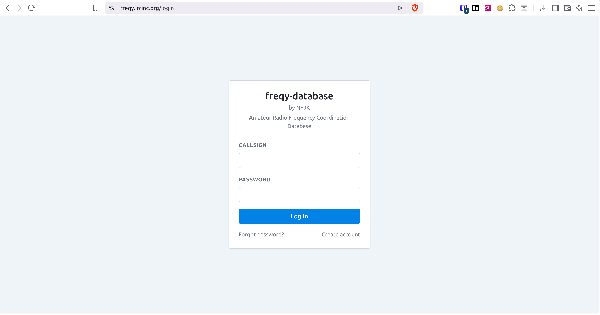
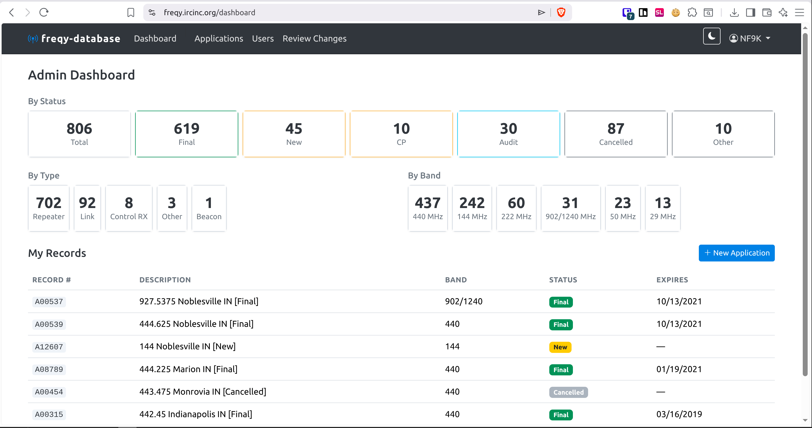
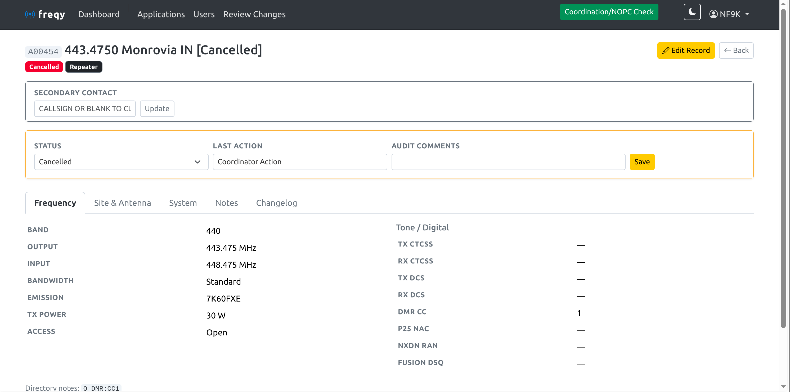
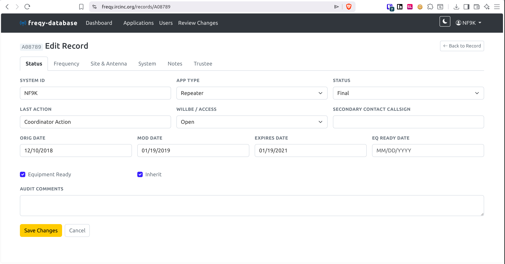
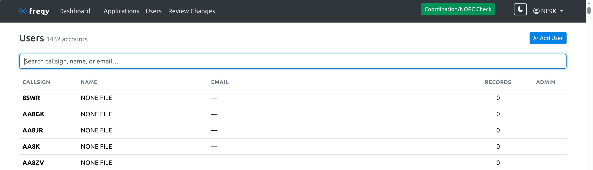
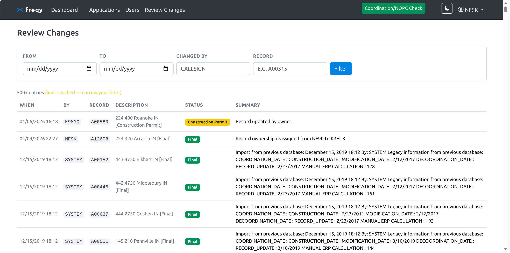

# freqy

Amateur Radio Frequency Coordination — a web-based replacement for legacy Flexweb flat-file coordination systems.

---

## Features

- **Coordination records** — full lifecycle management from application through Final status
- **User accounts** — self-registration, password recovery, profile management
- **Admin panel** — user management, record editing, status workflow, change review
- **FCC ULS integration** — daily callsign database sync; auto-populates name/address on user forms
- **Expiration notifications** — automated email reminders at 90/60/30/14/7/1 days
- **Two-factor authentication** — optional TOTP (Google Authenticator, Authy, etc.), YubiKey/FIDO2 security keys, and backup codes
- **Status tooltips** — hover any status badge for a plain-language description
- **Light/dark theme** — toggle between light and dark
- **Leaflet maps** — click-to-set TX site coordinates
- **Docker-native** — single `docker compose up` deployment

---

## Screenshots

| Login | Dashboard |
|-------|-----------|
|  |  |

| Record Detail | Record Edit |
|---------------|-------------|
|  |  |

| Admin Users | Review Changes |
|-------------|----------------|
|  |  |

---

## Stack

| Layer | Technology |
|-------|-----------|
| Language | Python 3.13 |
| Framework | Flask 3.0 |
| Auth | Flask-Login |
| Email | Flask-Mail (SMTP2GO) |
| Database | MariaDB 11 |
| DB Driver | mysqlclient (DictCursor) |
| Frontend | Bootstrap 5.3, Bootstrap Icons, Leaflet.js |
| Container | Docker + Compose |

---

## Quick Start

### Prerequisites

- Docker + Docker Compose
- SMTP2GO account (or compatible SMTP provider)

### 1. Configure environment

```bash
cp .env.example .env
# Edit .env with your values — see comments in the file
```

Generate a secret key:

```bash
python3 -c "import secrets; print(secrets.token_hex(32))"
```

### 2. Start the stack

```bash
docker compose up -d
```

This starts four containers:

| Container | Purpose |
|-----------|---------|
| `freqy` | Flask web application (gunicorn) |
| `freqy-db` | MariaDB 11 database |
| `freqy-fcc-import` | FCC ULS callsign sync (daily) |
| `freqy-expiration-notices` | Expiration email reminders (daily) |

The database schema is applied automatically on first boot.

### 3. Import legacy data (optional)

If migrating from a legacy Flexweb flat-file system:

```bash
docker cp /path/to/legacy_data freqy:/tmp/legacy_data
docker exec freqy python scripts/import_legacy.py /tmp/legacy_data
```

### 4. Create your admin account

Register via the web UI at `http://localhost:5000/register`, then promote yourself:

```bash
docker exec freqy python3 -c "
import os, MySQLdb
conn = MySQLdb.connect(host=os.environ['DB_HOST'], user=os.environ['DB_USER'],
                       passwd=os.environ['DB_PASSWORD'], db=os.environ['DB_NAME'], charset='utf8mb4')
cur = conn.cursor()
cur.execute('UPDATE users SET is_admin=1 WHERE callsign=%s', ('YOURCALL',))
conn.commit()
print('Done')
"
```

---

## Configuration

All configuration is via `.env`. See `.env.example` for all options.

| Variable | Description |
|----------|-------------|
| `SECRET_KEY` | Flask session secret — generate with `secrets.token_hex(32)` |
| `APP_URL` | Public base URL (used in emails) |
| `DB_HOST` | Must match the `container_name` of the db service (`freqy-db`) |
| `DB_NAME` / `DB_USER` / `DB_PASSWORD` | MariaDB credentials |
| `DB_ROOT_PASSWORD` | MariaDB root password |
| `SMTP_HOST` / `SMTP_PORT` | SMTP server (port 465 = SSL, port 587 = STARTTLS) |
| `SMTP_USER` / `SMTP_PASSWORD` | SMTP credentials |
| `SMTP_FROM_EMAIL` / `SMTP_FROM_NAME` | Sender identity |
| `ADMIN_NOTIFY_EMAILS` | Comma-separated addresses for new application alerts |

---

## Reverse Proxy

The app listens on port 5000. Place it behind nginx, Traefik, Caddy, or your proxy of choice. Set `APP_URL` to your public HTTPS URL so email links resolve correctly.

---

## Building

Always build and push both a versioned tag and `latest`:

```bash
docker build -t nf9k/freqy:X.XX -t nf9k/freqy:latest --build-arg VERSION=X.XX .
docker push nf9k/freqy:X.XX
docker push nf9k/freqy:latest
git tag vX.XX && git push --tags
```

## Updating

```bash
docker compose pull
docker compose up -d
```

---

## Contributors

See [CONTRIBUTORS.md](CONTRIBUTORS.md).

## License

GPLv3 — see [LICENSE](LICENSE).

---

*freqy by NF9K*
